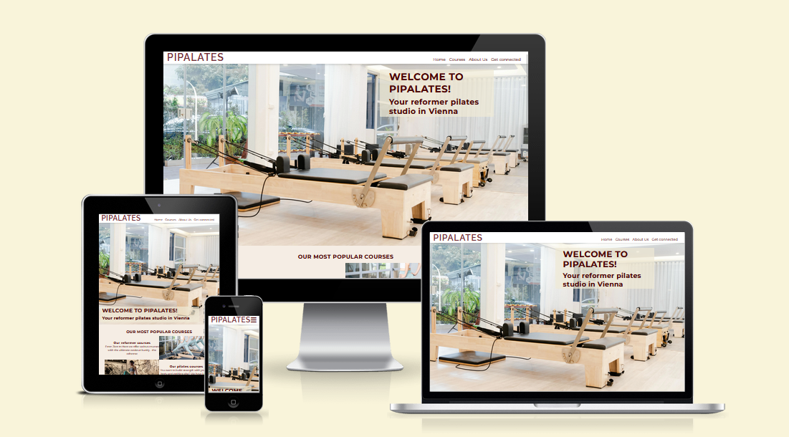
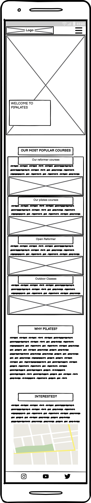
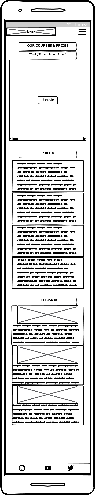
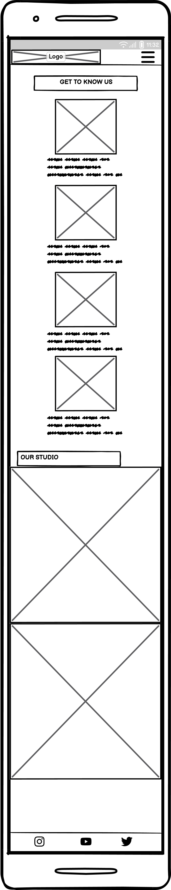
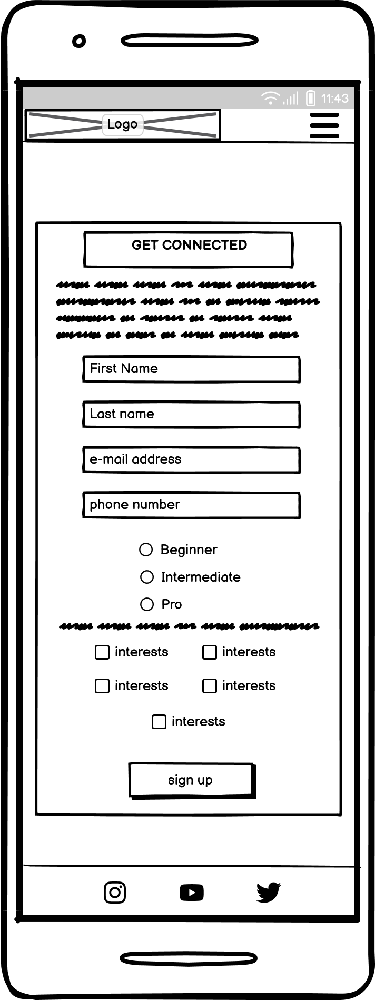

# Pipalates
Pipialtes is a static website that offers a pilates studio an online platform. The Pipalates studio itself offers pilates courses which are meant to improve the customers wellbeing. Through this webistes the user is informed about those services,a bout the studio and pilates over all. This webiste is hence meant to have a userbase made up of already existing customers as well as people that are interested in pialtes and reformer class in Vienna, Austria.

Pipalates' website includes basic pilates informations, information abut what courses exist and at what time those take place. Moreover, the website gives the user information about previous experience of customer via their feedback section. The location as well as more studio and team information is given to the user. If the user wants to stay up-to-date with information from the studio he or she can subscribe to a newsletter.

The live link can be found here - [Pipalates](https://xakkusu.github.io/1_project_pilates/index.html)

## Contents
- [SITE OWNER GOALS](#site-owner-goals)
- [USER EXPERIENCE (UX)](#user-experience-ux)
    - [User Stories](#user-stories)
- [WIREFRAMES](#wireframes)
- [FINAL DESIGN](#final-design)
    - [Color Scheme](#color-scheme)
    - [Typography](#typography)
    - [Final Look](#final-look)
- [FEATURES](#feautures)
- [TESTING](#testing)
    - [Fixed Bugs](#fixed-bugs)
- [TECHNOLOGIES USED](#technologies-used)
- [DEPLOYMENT](#deployment)
-[CREDITS](#credits)
- [ACKNOWLEDGEMENTS](#acknowledgments)

## SITE OWNER GOALS
- to provide the user with information that there is a pipalates studio in Vienna and motivate them to engage with it
- to provide the user with course information as well as course times of the pipalates studio
- to provide the user with a clear short overview of what pilates is and its benefits
- to provide the user with the location information of the pipalates studio
- to give feedback to the user of the pipalates studio's services
- to provide the user with information about teacher of the studio as well as equipment and look of the studio
- to offer the user the chance of staying in contact with the studio, to receive information about discounts, new events etc. all according to the user's preferences

## USER EXPERIENCE (UX)
### User Stories
#### First Time User Goals
- I want the website to be easy to understand the main purpose of the website
- I want the website to be easy to navigate
- I want to know about services/classes being offered
- I want to know the cost of courses
- I want to know when the courses will be held
- I want to know where the studio is located
- I want to know about trainers
- I want to know about the studios equipment
- I want to know how I can contact the studio

#### Returning User Goals
- I want to know updated information about courses (especially as I progress myself with the levels)
- I want to know how to contact the studio
- I want to stay up-tp-date with new classes and trainers

#### Frequent User Goals
- I want to stay up-tp-date with new classes and trainers
- I want to stay up-to-date with new studio equipment
- I want to be able to to show my feedback on the website via contact information

## WIREFRAMES
Wireframes were produced using Balsamiq. 

 

 
Desktop Wireframe

 

 

    
Mobile Wireframe

 

## FINAL DESIGN
### Color Scheme
### Typography
### Final Look

Desktop

 

 

    
Mobile

 

## FEAUTURES
## TESTING

### FIXED BUGS
1. header and navbar were styled incorrectly so that the header fully covered navbar/menu when its position is fixed:
    - added top margin in main element which is the same as the height of header
    - added high z-index (99) so that the menu will stay on top of the layout when scrolling
    Now menu didn't fit screen and positioning was off:
    - added absolute position in navbar so that its position stay relative to the header and is taken out of the normal flow
    - menu items were placed directly under header with top:100% and placed left:0
2.  table wasn't wholy visible on smaller screens
    - the table for weekdays was horizontally too large for mobile devices but adding the days below one another would have taken too much space and could be confusing for user to compare days and time
    - added overvlow-x:auto to tabble element to add a horizontal scroll bar for table content which was too big for its block level element; user can however always rotate their phone which would show it wholy either way
3. From 992px and upwards the size of the index-page was dislocated from the size of the screen, which after some testing was found out to have come from the Why Pilates?-section on that page
    - width of why-pilates and of best-courses section were to wide, especially the may width with no min width attribute in the why pilates section
    - added min width attribute which is smaller than starting screen size of this media query and giving it a new max width attribute, same with the best-course section
    - content were well fitted to screen size again

## TECHNOLOGIES USED

## DEPLOYMENT
The steps to deploy this project using GitHub pages were the following:
1. Go to the Settings tab of your GitHub repository.
2. On the left-hand sidebar, in the Code and automation section, select "Pages§.
3. Make sure to select the following:
    - Source is set to 'Deploy from Branch'.
    - Main branch is selected.
    - Folder is set to / (root).
4. Click Save next to /root.
5. "Your GitHub Pages site is currently being built from the main branch." shows up.
6. Go back to the Code tab. Wait a few minutes for the build to finish and refresh your repository where a Deployments section will show the deployed project.

The live link can be found here - [Pipalates](https://xakkusu.github.io/1_project_pilates/index.html)

## CREDITS
## ACKNOWLEDGMENTS
