# Pipalates
Pipalates is a static website that offers a pilates studio an online platform. The Pipalates studio itself offers pilates courses which are meant to improve the customers wellbeing. Through this website the user is informed about those services, about the studio and pilates over all. This website is hence meant to have a userbase made up of already existing customers as well as people that are interested in pilates and reformer classes in Vienna, Austria.

Pipalates' website includes basic pilates information, information about what courses exist and at what time those take place. Moreover, the website gives the user information about previous customer experience via their feedback section. The location as well as more studio and team information is given to the user. If the user wants to stay up-to-date with information from the studio he or she can subscribe to a newsletter.

The live link can be found here - [Pipalates](https://xakkusu.github.io/1_project_pilates/index.html)

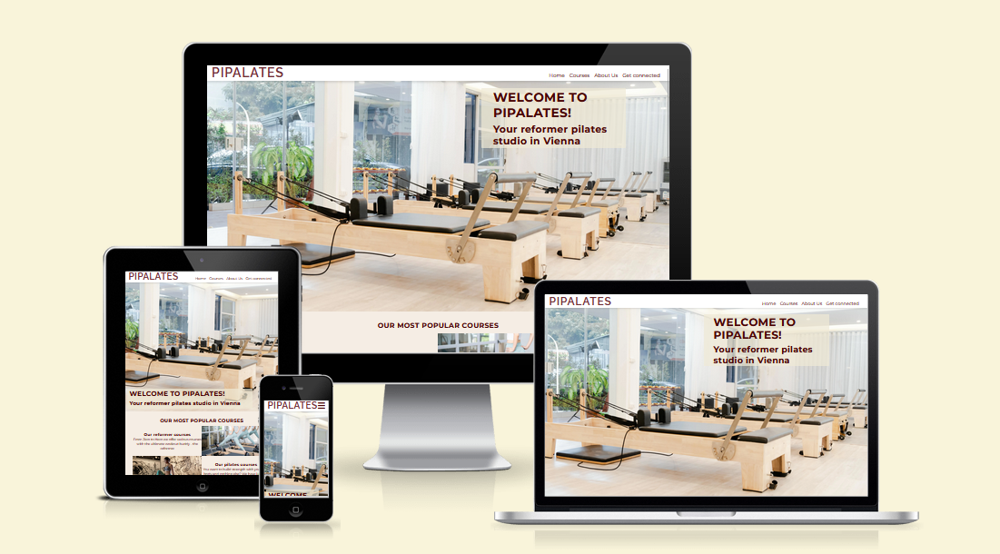

## Contents
- [SITE OWNER GOALS](#site-owner-goals)
- [USER EXPERIENCE (UX)](#user-experience-ux)
    - [User Stories](#user-stories)
- [WIREFRAMES](#wireframes)
- [FINAL DESIGN](#final-design)
    - [Imagery](#imagery)
    - [Color Scheme](#color-scheme)
    - [Typography](#typography)
    - [Visual Effects](#visual-effects)
    - [Final Look](#final-look)
- [FEATURES](#feautures)
    - [Index Page](#index-page)
    - [Courses Page](#courses-page)
    - [About Us Page](#about-us-page)
    - [Get Connected Page](#get-connected-page)
- [TESTING](#testing)
    - [Accessibility](#accessibility)
    - [W3C Validators](#w3c-validators)
    - [Form Testing](#form-testing)
    - [Links Testing](#links-testing)
    - [Browser Testing](#browser-testing)
    - [Device Testing](#device-testing)
    - [User Stories Testing](#user-stories-testing)
    - [Fixed Bugs](#fixed-bugs)
- [TECHNOLOGIES USED](#technologies-used)
    - [Languages](#languages)
    - [Frameworks, Libraries and Programs used](#frameworks-libraries-and-programs-used)
- [DEPLOYMENT](#deployment)
- [CREDITS](#credits)
    - [Media](#media)
    - [Resources](#resources)
- [ACKNOWLEDGEMENTS](#acknowledgements)

## SITE OWNER GOALS
- to provide the user with information that there is a pipalates studio in Vienna and motivate them to engage with it
- to provide the user with course information as well as course times of the pipalates studio
- to provide the user with a clear short overview of what pilates is and its benefits
- to provide the user with the location information of the pipalates studio
- to give feedback to the user of the pipalates studio's services
- to provide the user with information about trainers of the studio as well as equipment and look of the studio
- to offer the user the chance of staying in contact with the studio, to receive information about discounts, new events etc. all according to the user's preferences

## USER EXPERIENCE (UX)
### User Stories
#### First Time User Goals
- I want the main purpose of the website to be easy to understand
- I want the website to be easy to navigate
- I want to know about services/classes being offered
- I want to know the cost of courses
- I want to know when the courses will be held
- I want to know where the studio is located
- I want to know about trainers
- I want to know about the studios equipment
- I want to know how I can contact the studio

#### Returning User Goals
- I want to know updated information about courses (especially as I progress with the levels)
- I want to know how to contact the studio
- I want to stay up-tp-date with new classes and trainers

#### Frequent User Goals
- I want to stay up-tp-date with new classes and trainers
- I want to stay up-to-date with new studio equipment
- I want to be able to to show my feedback on the website via contact information

## WIREFRAMES
Wireframes were produced using Balsamiq. 

 

 
Desktop Wireframe

Index Page:

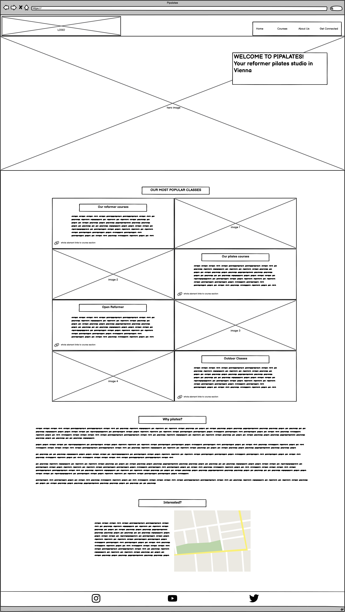

Courses Page:

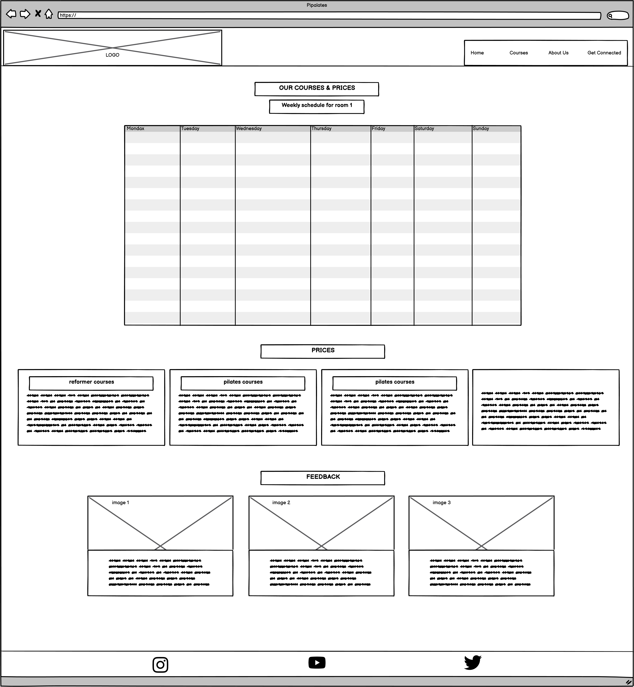

About Us Page:

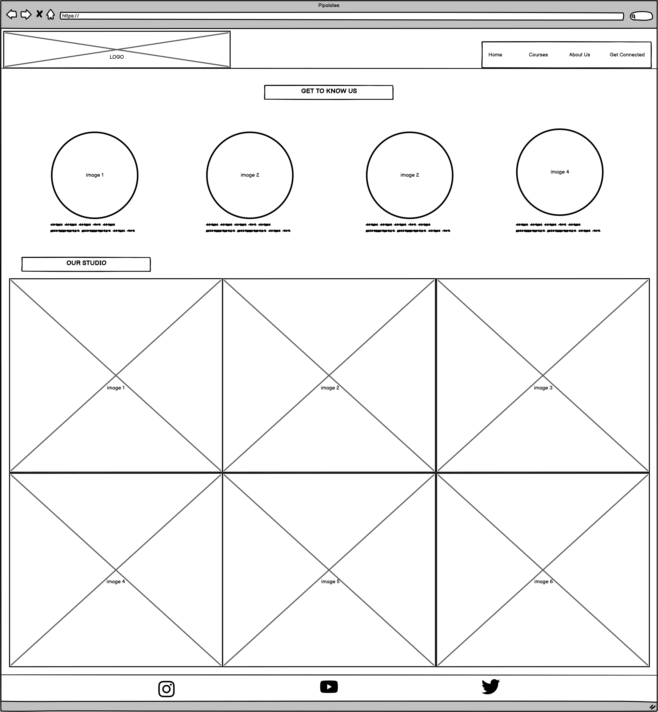

Get Connected Page:

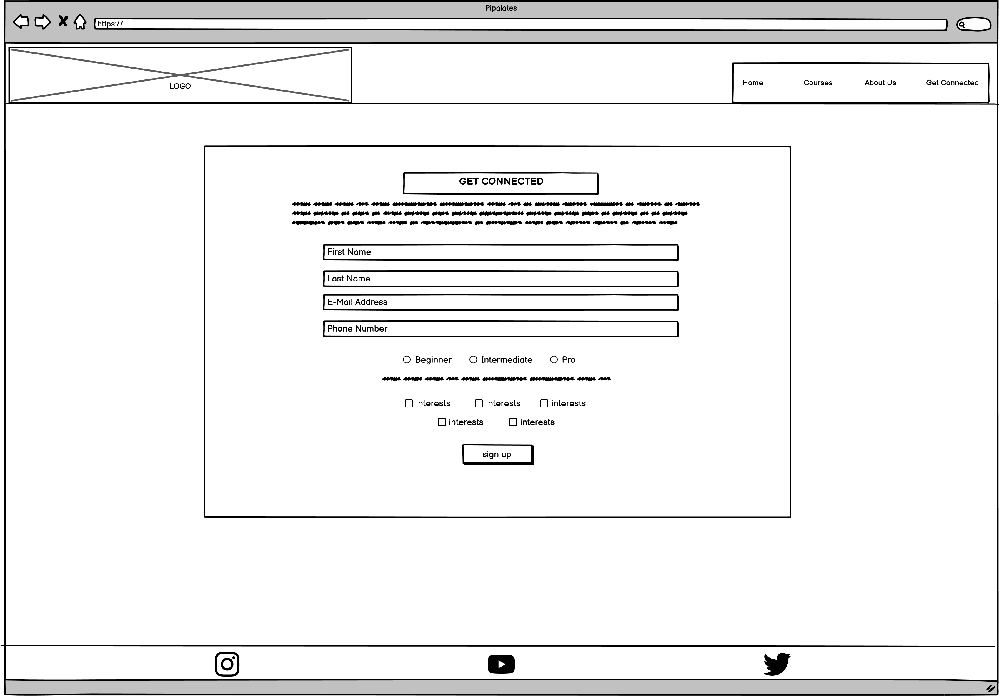

 

 

    
Mobile Wireframe

Index Page:

Courses Page:

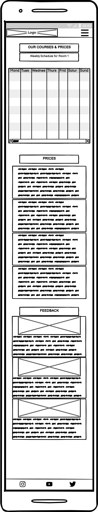

About Us Page:

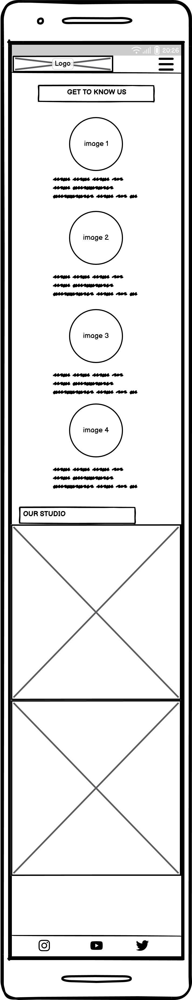

Get Connected Page:

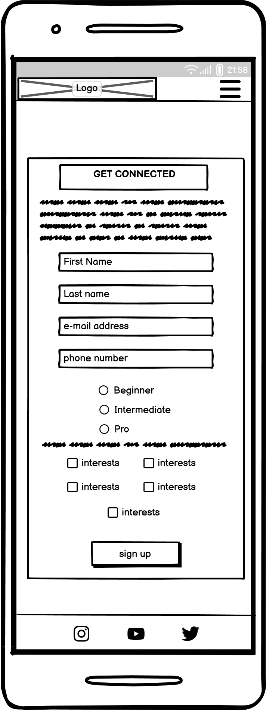

 

## FINAL DESIGN
### Imagery
All images on the webpage were taken from pexels.com and unsplash.com. I have credited these in the [credits](#credits) section. All images on this website are free stock photos which are royalty free. The images were selected as they showed pilates, a pilates studio and people in an aesthetically pleasing way. The studio images were especially chosen in line with the color theme used for this website using brownish earthly colors. Hence these colors correlate as good as possible with a relaxed but yet strong overall theme of the website and pilates itself.

### Color Scheme
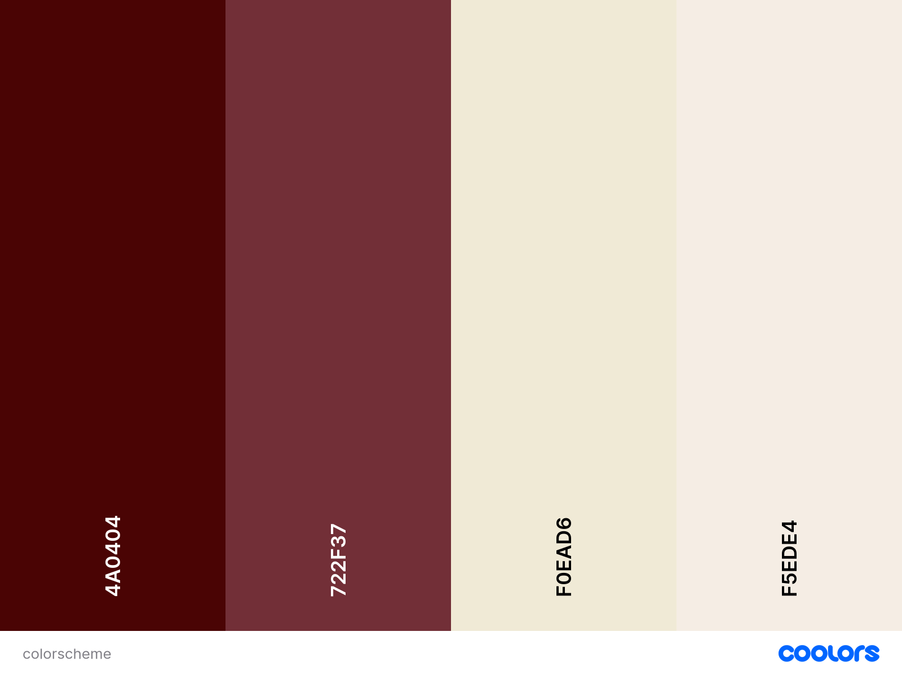
Brown-redish and beige colors were chosen for a relaxed feeling but at the same time a sense of strength. Brown colors are often used in pilates studio designs as well as in pilates' clothing and accessories therefore these colors were chosen as they are already established within the community.
The color palette was created by using the [coolors](https://coolors.co/) website.

### Typography
[Google Fonts](https://fonts.google.com/) was used for the following fonts:
- 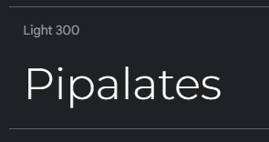 
[Montserrat](https://fonts.google.com/specimen/Montserrat) was chosen for the main body as it was neutral and easy to read.
- 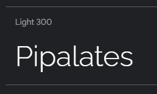 
For the final H1 Heading [Raleway](https://fonts.google.com/specimen/Raleway) was used to lift the website's name/Logo apart from the other text, but not too much to keep in line with the general visual outlook of the page.
- Sans Serif was chosen as a backup font, in case for any reason the main font isn't being imported into the site correctly.

### Visual Effects
Images and more information for these effects are given in the [Features](#feautures) part.
#### Shadows
The navbar/header-element has a box-shadow on the mobile device as well as on all other screen sizes as it is fixed at the top of the screen while scrolling. Through this it sets itself apart from the other content, hinders blending with said content and serves as a visual-anchor-point for users.
The Get Connected Form, the content of the schedule-table, images of trainers and feedback elements all have shadows as well to lift themselves up from the other content.
#### Navbar Hover Effect
On larger screens when choosing a menu-section a hover-effect will appear on the topic on which the cursor is "on top off". The font-color will turn white while the background will appear in a darker brown color to make it stand out.
#### Hover over images
On large screens for the feedback text, instead of being under the images of the image, the text will be shown on top of it while hovering over them. The font-color will turn white and the background color brown-reddish to make it stand out.
#### Button
On the Sign-Up-Form of the get connected page when hovering over the "sign up" button the buttons font-color and background color will switch. Thus the font-color will be white and the background color a dark brown. The cursor itself will be shown as a cursor when hovering the element. This is done to on the one hand make it stand out and on the other signal to the user that it can be clicked.

### Final Look
 

Desktop

Index Page:

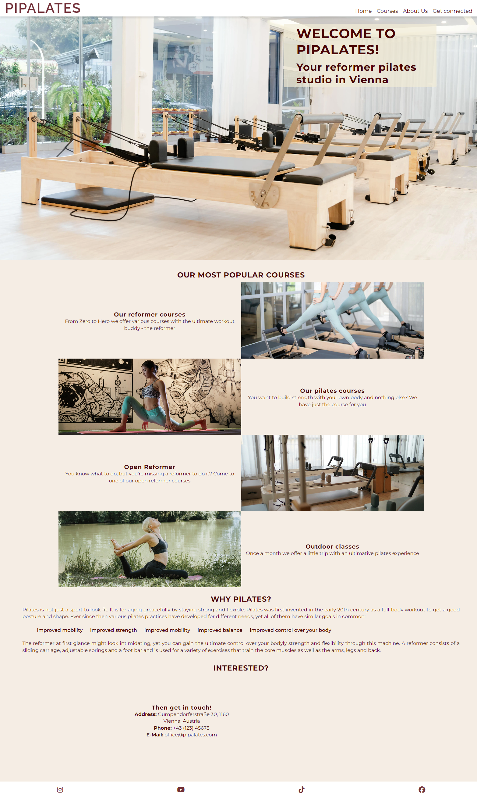

Courses Page:

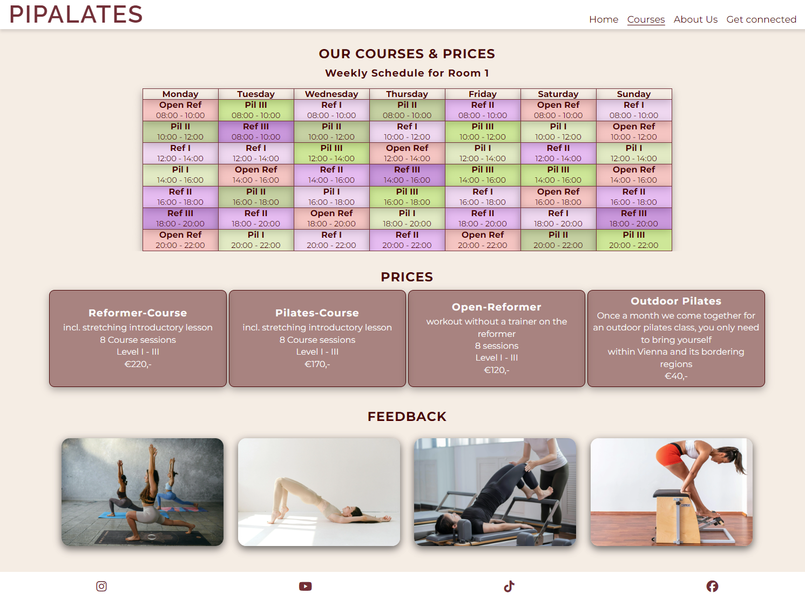

About Us Page:

Get Connected Page:

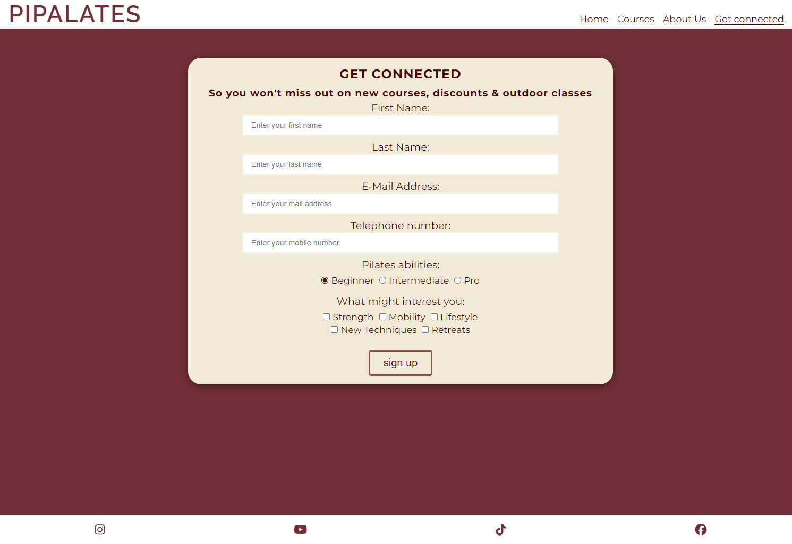

 

 

    
Mobile

Index Page:

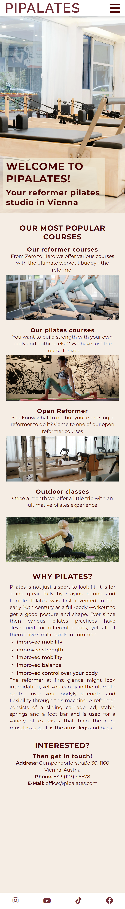

Courses Page:

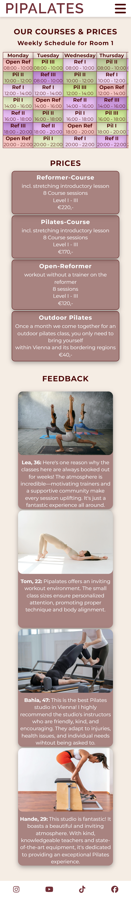

About Us Page:

Get Connected Page:

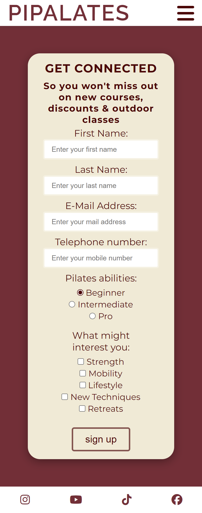

 

## FEATURES
All pages have the following in common:
#### Favicon
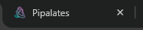

#### Navbar

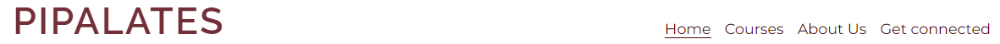

- The navbar includes the Logo and the menu. The menu consists of Home, Courses, About Us, Get Connected pages, these items are located on the right.
- The navbar is fixed at the top so that it stays visible while scrolling the page, hence the user is able to navigate themselves from page to page whenever they please.
- When selecting a menu item the selected page will open in the same window.
- When selecting the logo the index page will open.

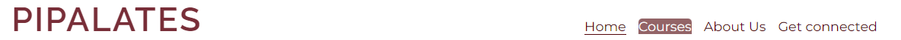

- When hovering the menu items the background color of the hovered item will change to a darker brown and its font-color will change to white.
- While being on a page the navbar menu item that belongs to the open page is shown with an underline.

  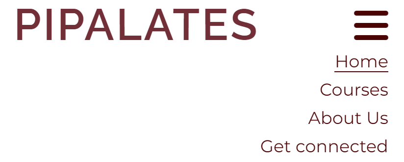

- On smaller screens the menu items are replaced by a burger-menu-icon. When selected the menu items are shown via a drop down option and can then be selected

#### Footer

- The footer section includes Pipalates' Instagram, Youtube, TikTok and Facebook pages.
- When selecting one of these links, a new tab will open to that social-media platform.

### Index Page
#### Hero Image
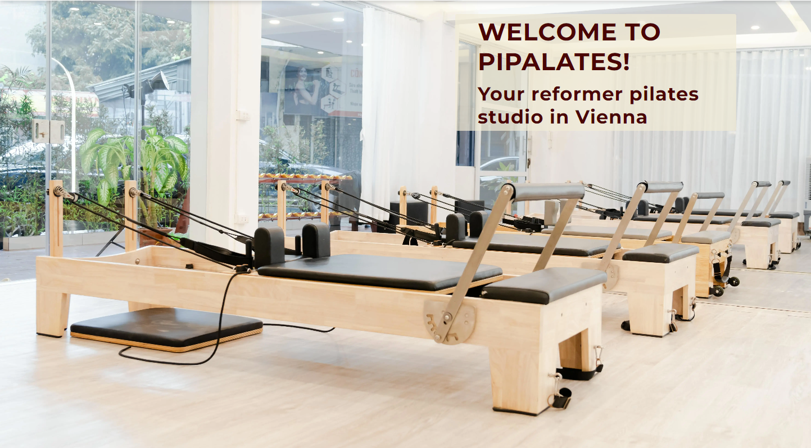

- The visually pleasing image of a pilates studio with reformers lined up behind one another.
- The semi-transparent cover text informs the user about the main topic of the website while being in line with the overall color scheme of the website.
- The image is responsive and the cover text switches to the left side on smaller screens to not be on top of the reformer. This way the main message of the website is still transferred to the user

#### Best Courses Section
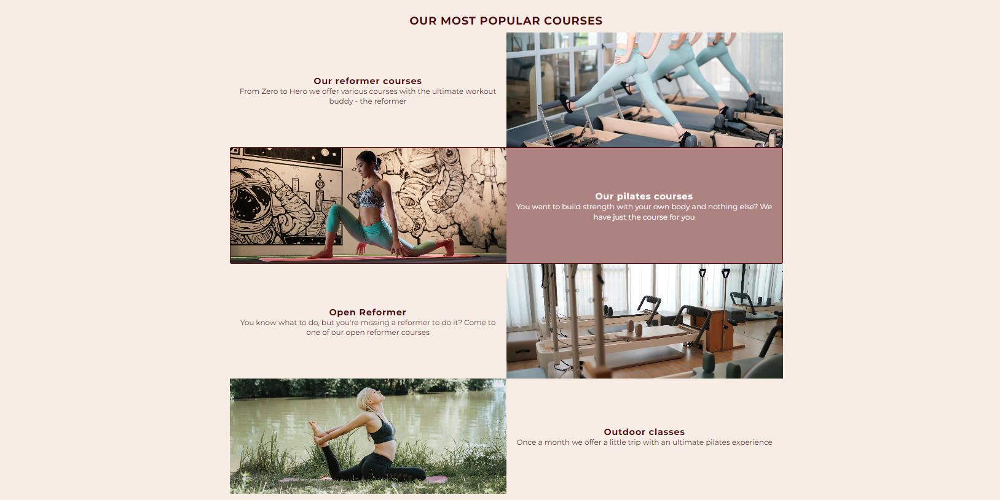

- This section is subdivided into 4 parts for each course: a short description for the user of the course as well as a fitting picture of something similar to the course so the user gets a visual representation of the course as well
- On larger screens when hovering over a course-image-box the box will have a dark border, a darker brownish background color and the font-color will be white.
- The course-image-box's can be selected and will open a new tab to the according prices section on the courses page.
- On smaller screens the images and text are ordered under one another and are hence responsive to different devices.
- This section shows the user the main service the studio offers, the courses. Through visual effects and the linked parts the user could directly transfer to the section about the courses with further information about them.

#### Why Pilates Section
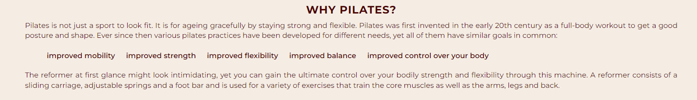

- This section gives a brief description of what pilates is and highlights its benefits to the user. 
- The section is responsive to screen size and will adapt accordingly.

#### Location Section

- This section includes a block of different kinds of contact information and an iframe of an embedded Google Map showing the studio's location.
- This will enable the user to have various contact points with the studio in case of questions as well as knowing the direct location of the studio in case they will attend classes.
- The section is responsive to screen size and will adapt accordingly.

### Courses Page
#### Schedule Table Section
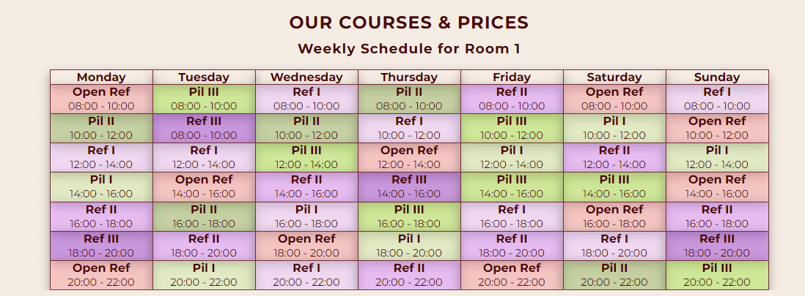

- This section informs the user about the times of courses via a table.
- For easier understanding the same courses are colored according to their level.

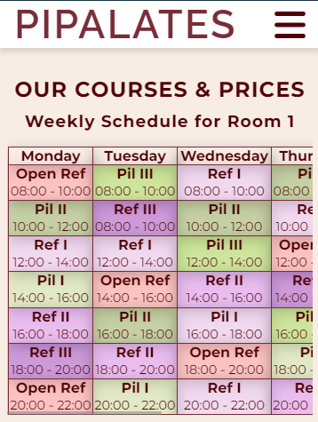

- For mobile device user the full table can be accessed with a horizontal scrollbar. Through this no data is neglected by smaller sizing and it does not disrupt the reading flow of the user.
- The naming of each course with its course level in numeric letters is used as this is common practice to name courses in the pilates, yoga and aerial sports industry so users are often already familiar with this wording.

#### Course Prices Section
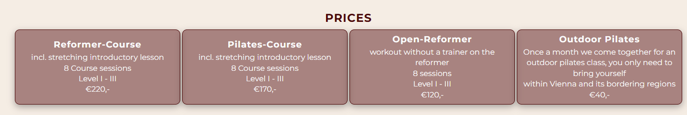

- This section is held as simple and basic as possible, as it has to do with product/service information and the easier it is for the user to understand these the more likely they will be to choose one.
- Each course-price-box consists of information about the course, units and its price. The boxes are responsive and are placed horizontally beneath one another on smaller devices.

#### Feedback Section
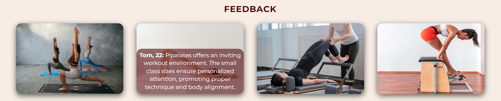

- This section gives the user the option to read feedback of from customers about the courses. This is done to give confidence to the user in the studio's abilities.
- On larger screens there is a hover effect on top of each picture. The feedback text will appear when hovering the picture.

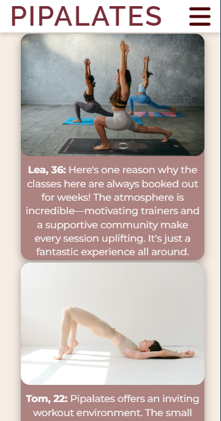

- On smaller screens the feedback text is located below each picture so it is still readable and easy to understand in the website's colors.

### About Us Page
#### Get To Know Us Section

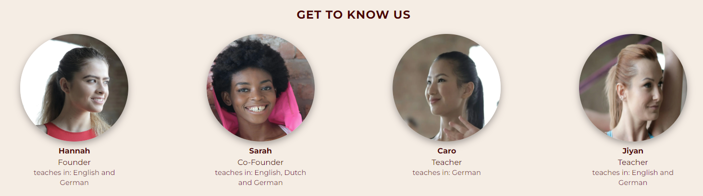

- This section presents the trainers to the user as well as who is in charge of the studio. Through this and the information given about the trainers a few informational needs of the users are already met.
- The section is responsive to screen size and will adapt accordingly.

#### Our Studio Section
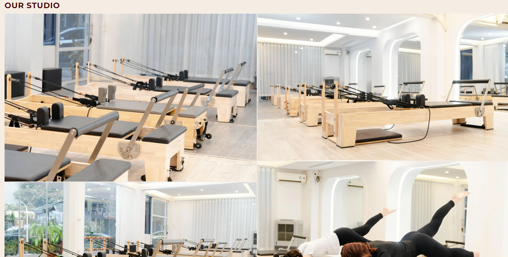

- This section incorporates 7 images of the studio from different angles and some with people training on the equipment. This gives the user a better visual presentation about the studio and if it is according to their needs. 
- The section is responsive to screen size and will adapt width and number of columns accordingly. The images all are chosen to not deviate from the color scheme and give an inviting impression to the user.

### Get Connected Page
#### Get Connected Section

- This section invites the user to receive a newsletter from the pipalates studio after entering all necessary contact information of the user. Necessary user information: first name, last name, e-mail address and ability level. All other input elements are voluntary.
- When selecting the input elements to write in, the border will switch to a brown color to indicate tot he user which element is selected.
- The sign-up button will change to a darker color with bright font-color and will change the cursor to a pointer so it is made easier for the user to find the element to submit his data with.
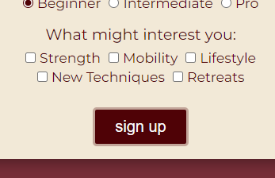

- The section is responsive to screen size and will adapt accordingly.
- After selecting the sign-up button the user will be transferred to the code institute's official formdump page to indicate that the sign-up process was successful. The entered data is shown on this page as well.

## TESTING
### Accessibility
#### Lighthouse Testing
##### Index Page
Desktop

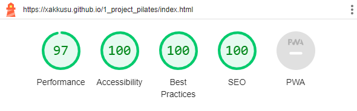

Mobile

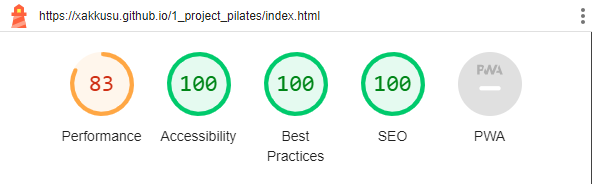

##### Courses Page
Desktop

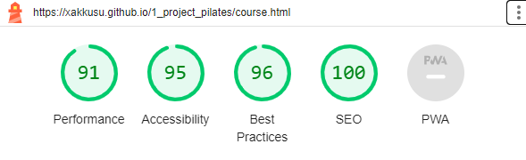

Mobile

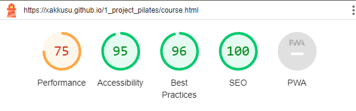

##### About Us Page
Desktop

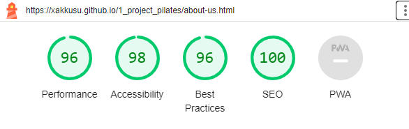

Mobile

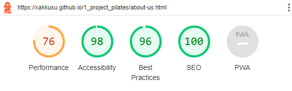

##### Get Connected Page
Desktop

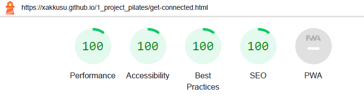

Mobile

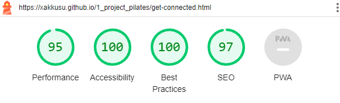

#### Wave Testing
##### Index Page

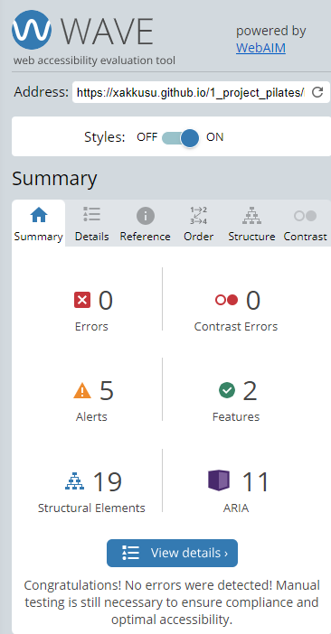

##### Courses Page

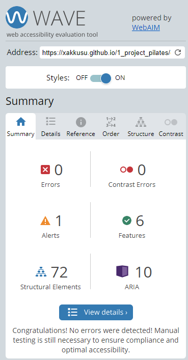

##### About Us Page

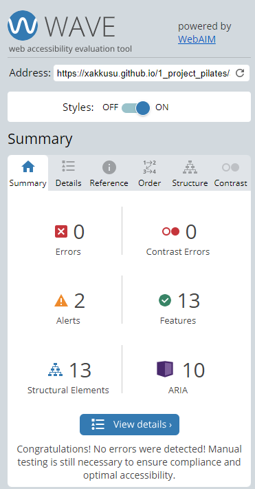

##### Get Connected Page

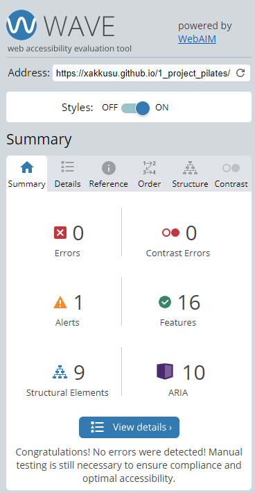

### W3C Validators
#### HTML
No errors were returned for all pages from the W3C Markup Validator:

- [Index Page HTML-validator results](https://validator.w3.org/nu/?doc=https%3A%2F%2Fxakkusu.github.io%2F1_project_pilates%2Findex.html)

- [Courses Page HTML-validator results](https://validator.w3.org/nu/?doc=https%3A%2F%2Fxakkusu.github.io%2F1_project_pilates%2Fcourse.html)

- [About Us Page HTML-validator results](https://validator.w3.org/nu/?doc=https%3A%2F%2Fxakkusu.github.io%2F1_project_pilates%2Fabout-us.html)

- [Get Connected Page HTML-validator results](https://validator.w3.org/nu/?doc=https%3A%2F%2Fxakkusu.github.io%2F1_project_pilates%2Fget-connected.html)

#### CSS
No errors were returned for the CSS stylesheet from the W3C CSS Validator:

- [Stylesheet CSS-validator results](https://jigsaw.w3.org/css-validator/validator?uri=https%3A%2F%2Fxakkusu.github.io%2F1_project_pilates%2Findex.html&profile=css3svg&usermedium=all&warning=1&vextwarning=&lang=en)

### Form Testing
The form has been successfully tested if it would submit with missing or wrong data input.
Required data: first name, last name, e-mail address and ability level.
All other fields are voluntary, yet when entering a phone number only at least 5 numbers are allowed.

### Links Testing
- All internal links are working and redirecting the user to the sections/pages they are meant to redirect them to. In case of the links to the course prices from the index page those are opened in a separate tab.
- All external links are working and redirecting, through a separate tab, the user to the external website they are meant to be redirected to.

### Browser Testing
The website was successfully tested on the following browsers:
- Google Chrome
- Mozilla Firefox
- Safari
- Microsoft Edge

### Device Testing
- This website was viewed and tested on various devices such as smartphones (Iphone X, Huawei P40 Pro+), laptops and desktops to guarantee that it is responsive for several screen sizes. Full successful testing was performed on all of the devices.

- The following websites, besides google dev tools, were used to check responsiveness:
    - [Am I Responsive - Index Page](https://ui.dev/amiresponsive?url=https://xakkusu.github.io/1_project_pilates/index.html)
    - [Am I Responsive - Courses Page](https://ui.dev/amiresponsive?url=https://xakkusu.github.io/1_project_pilates/course.html)
    - [Am I Responsive - About Us Page](https://ui.dev/amiresponsive?url=https://xakkusu.github.io/1_project_pilates/about-us.html)
    - [Am I Responsive - Get Connected Page](https://ui.dev/amiresponsive?url=https://xakkusu.github.io/1_project_pilates/get-connected.html)
    - [Responsinator - Index Page](http://www.responsinator.com/?url=https%3A%2F%2Fxakkusu.github.io%2F1_project_pilates%2Findex.html)
    - [Responsinator - Courses Page](http://www.responsinator.com/?url=https%3A%2F%2Fxakkusu.github.io%2F1_project_pilates%2Fcourse.html)
    - [Responsinator - About Us Page](http://www.responsinator.com/?url=https%3A%2F%2Fxakkusu.github.io%2F1_project_pilates%2Fabout-us.html)
    - [Responsinator - Get Connected Page](http://www.responsinator.com/?url=https%3A%2F%2Fxakkusu.github.io%2F1_project_pilates%2Fget-connected.html)

### User Stories Testing
#### First Time User Goals
- I want the main purpose of the website to be easy to understand
    
    The website's main content is clearly presented on the index page (and other pages) and its structure is similar to the top 3 pilates studio website's in Vienna so the user would be familiar with the layout.
- I want the website to be easy to navigate
    
    Through the navbar which by being fixed is present whenever the user can navigate to all pages whenever they want to.
- I want to know about services/classes being offered

    On the index page and the courses page clear and compact information about courses are presented.
- I want to know the cost of courses

    The courses page offers price details for all available courses.
- I want to know when the courses will be held

    The courses page offers a timetable with the courses. The same courses are colored the same way so it will be easier for the user to find fitting times and courses.
- I want to know where the studio is located

    On the index page the address as well as an interactive google maps tool, to show where the studio is located, is provided.
- I want to know about trainers

    The about us page offers names, images and further information about the trainers the studio employs.
- I want to know about the studios equipment

    The about us page provides several images of the Studio in the Our Studio section for the user to be able to make themself a better picture about the studio.
- I want to know how I can contact the studio

    The index page offers an e-mail address as well as a phone number. The footer with all social media links is present on all pages.

#### Returning User Goals
- I want to know updated information about courses (especially as I progress with the levels)

    The courses page is updated regularly. However, when signing up for the newsletter the user will be directly informed about new courses.
- I want to know how to contact the studio

    The index page offers an e-mail address as well as a phone number. The footer with all social media links is present on all pages.
- I want to stay up-tp-date with new classes and trainers

    The user can sign-up for the newsletter and will hence be always directly informed, about topics that interest them, via mail about all updates.

#### Frequent User Goals
- I want to stay up-tp-date with new classes and trainers + I want to stay up-to-date with new studio equipment

    The user can sign-up for the newsletter and will hence be always directly informed, about topics that interest them, via mail about all updates.

- I want to be able to to show my feedback on the website via contact information

    The index page offers an e-mail address as well as a phone number. The footer with all social media links is present on all pages. When contacting the studio via one of these channels the feedback can be displayed on the feedback section on the courses page.

### Fixed Bugs
1. Header and navbar were styled incorrectly so that the header fully covered navbar/menu when its position is fixed:
    - added top margin in main element which is the same as the height of header
    - added high z-index (99) so that the menu will stay on top of the layout when scrolling

    Now menu didn't fit screen and positioning was off:
    - added absolute position in navbar so that its position stay relative to the header and is taken out of the normal flow
    - menu items were placed directly under header with top:100% and placed left:0
2.  Table wasn't wholly visible on smaller screens
    - the table for weekdays was horizontally too large for mobile devices but adding the days below one another would have taken too much space and could be confusing for user to compare days and times
    - added overvlow-x:auto to table element to add a horizontal scroll bar for table content which was too big for its block level element; user can however always rotate their phone which would show it wholy either way
3. From 992px and upwards the size of the index-page was dislocated from the size of the screen, which after some testing was found out to have come from the Why Pilates?-section on that page
    - width of why-pilates and of best-courses section were to wide
    - added min width attribute which is smaller than starting screen size of this media query and giving it a new max width attribute, same with the best-course section
    - content were well fitted to screen size again
4. On the index page all course boxes were meant to link to the according course box on the courses page. However when opening the link on mobile devices the link would open up with a delayed jump to the box on courses page, yet only showing part of the element not the whole element:
    - got rid of the singular links for each course
    - on index page put the whole element in an anchor element which again links now through the href attribute to the whole price section (includes course boxes) one the courses page

## TECHNOLOGIES USED
### Languages
- HTML
- CSS

### Frameworks, Libraries and Programs used
- [Balsamiq](https://balsamiq.com/wireframes/)- Used to create wireframes.
- [GitHub](https://GitHub.com/) - Used for version control and hosting.
- [Gitpod](https://gitpod.io/) - IDE to develop the website.
- [Google Fonts](https://fonts.google.com/) - Used to import  fonts used on website.
- [FontAwesome](https://fontawesome.com/) - Used for footer's and navbar's icon.
- [Google Chrome Dev Tools](https://developers.google.com/web/tools/chrome-devtools)- Used for troubleshooting, debugging, inspecting page's elements, testing responsiveness and styling elements.
- [pexels](https://www.pexels.com/) - Used for free images.
- [unsplash](https://unsplash.com/de) - Used for free images.
- [Favicon.cc](https://www.favicon.cc/) - Used for website's favicon.
- [Coolors](https://coolors.co/) - Used to create color palette.
- [Google Chrome's Lighthouse](https://developers.google.com/web/tools/lighthouse) - Used to test performance and accessibility.
- [Wave](https://wave.webaim.org/) Used to test accessibility.
- [W3C HTML Markup Validator](https://validator.w3.org/) Used to validate HTML code.
- [W3C Jigsaw CSS Validator](https://jigsaw.w3.org/css-validator/) Used to validate CSS code.
- [Am I Responsive](https://ui.dev/amiresponsive) Used to test responsiveness.
- [Responsinator](http://www.responsinator.com/) Used to verify responsiveness especially usage for mobile devices.

- Code Institute's Gitpod Template to generate IDE workspace.

## DEPLOYMENT
The steps to deploy this project using GitHub pages were the following:
1. Go to the Settings tab of your GitHub repository.
2. On the left-hand sidebar, in the Code and automation section, select "Pages".
3. Make sure to select the following:
    - Source is set to 'Deploy from Branch'.
    - Main branch is selected.
    - Folder is set to / (root).
4. Click Save next to /root.
5. "Your GitHub Pages site is currently being built from the main branch." shows up.
6. Go back to the Code tab. Wait a few minutes for the build to finish and refresh your repository where a Deployments section will show the deployed project.

The live link can be found here - [Pipalates](https://xakkusu.github.io/1_project_pilates/index.html)

How to run the project locally:

Fork the repository:
- Log in (or sign up) to Github.
- Go to the repository for: Xakkusu/1_project_pilates.
- Click the Fork button in the top right corner.

#### Clone repository:
1. Log in (or sign up) to GitHub.
2. Go to the repository for: Xakkusu/1_project_pilates.
3. Click on the code button, select whether you would like to clone with HTTPS, SSH or GitHub CLI and copy the link shown.
4. Open the terminal in your code editor and change the current working directory to the location you want to use for the cloned directory.
5. Type 'git clone' into the terminal and then paste the link you copied in step 3. Press enter.
6. A clone of the repository will now be created on your machine.

## CREDITS
### Media
All images on this website were taken from unplash.com and pexels.com, thanks to the talented photographers:
- [Hero Image & Studio image](https://www.pexels.com/de-de/foto/sport-innere-interior-fitness-18499502/) - Lê Đức
- [Studio image](https://www.pexels.com/de-de/foto/sport-innere-interior-fitness-18499500/) - Lê Đức
- [Studio image](https://www.pexels.com/de-de/foto/sport-fitness-modern-studio-18499504/) - Lê Đức
- [Studio image](https://www.pexels.com/de-de/foto/frauen-sport-fitness-sportbekleidung-18499503/) - Lê Đức
- [Studio image](https://www.pexels.com/de-de/foto/frau-sport-fitness-athlet-18499514/) - Lê Đức
- [Studio image](https://www.pexels.com/de-de/foto/holzern-innere-interior-werkzeuge-18075025/) - Lê Đức
- [Trainer Image](https://www.pexels.com/photo/young-asian-woman-warming-up-in-gym-4376663/) - Andrea Piacquadio
- [Trainer Image](https://www.pexels.com/photo/young-sportswoman-doing-stretch-exercise-with-elastic-band-in-modern-gym-4376713/) - Andrea Piacquadio
- [Trainer Image](https://www.pexels.com/photo/cheerful-woman-with-laptop-wearing-sporty-clothes-4376756/) - Andrea Piacquadio
- [Trainer Image](https://www.pexels.com/photo/cheerful-diverse-sportswomen-standing-near-brick-wall-4376742/) - Andrea Piacquadio
- [Courses Image](https://www.pexels.com/de-de/foto/baume-fluss-ubung-yoga-5038894/) - olia danilevich
- [Courses Image](https://www.pexels.com/de-de/foto/frauen-starke-dehnen-fitnessstudio-9649708/) - Nicholas Fu
- [Courses Image](https://unsplash.com/de/fotos/frau-macht-yoga-neben-wandmalerei-30-s47k-U-Q) - i yunmai
- [Courses Image](https://unsplash.com/de/fotos/eine-reihe-von-trainingsgeraten-in-einem-fitnessstudio-JmjDBhXSjyI) - freya yanggg yang
- [Feedback Image](https://www.pexels.com/de-de/foto/menschen-frauen-gruppe-friedvoll-6246658/) - KoolShooters
- [Feedback Image](https://www.pexels.com/de-de/foto/gesund-frau-brucke-kurve-5012071/) - Anna Shvets
- [Feedback Image](https://www.pexels.com/de-de/foto/frau-fitness-ubung-ausbildung-5473897/) - Maria Charizani
- [Feedback Image](https://www.pexels.com/de-de/foto/fitnesstrainerin-hilft-frau-beim-pilates-9288101/) - Nicholas Fu

### Content Inspiration
- [pilatesboutiquevienna](https://pilatesboutiquevienna.at/)
- [diederStudio](https://diederstudio.at/)
- [pystudio](https://www.pystudio.at/)

### Resources
- Tutorials from Code Institute's lessons that we learned in the course of our diploma-education used to create a basic structure of the website. Especially topics from the Love Running project were helpful.

- [Stack Overflow](https://stackoverflow.co/)

- [MDN](https://developer.mozilla.org/en-US/)

- [W3Schools](https://www.w3schools.com/)

- [ChatGPT](https://openai.com/chatgpt/) for comming up with review text from customers as I was lacking the fantasy for it

- Readm.md file was created based on the structure of [AliOkeeffe](https://github.com/AliOKeeffe/mindyoga?tab=readme-ov-file) and [emilycheatham](https://github.com/emilycheatham/p1_yoga_for_you/blob/main/README.md).

## ACKNOWLEDGEMENTS
- My mentor Antonio for their guidance and support.
- Code Institute for informative course material.
- The Code Institute's Slack community for support and reviewing my project.